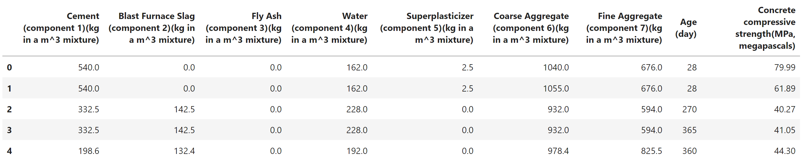

# Project 4

My name is Bryce Whitney and this page details my experiments for project 4 in Advanced Applied Machine Learning. This page includes testing different regressor combinations in boosting and analyzing the effectiveness of each method, along with a theoretical discussion and application of LightGBM.

## Concrete Dataset

For all the analysis I used the [Concrete Compressive Strength Data Set](https://archive.ics.uci.edu/ml/datasets/concrete+compressive+strength) to train the  models and compare the results. The structure of the data can be seen below:
  


In this dataset, the dependent variable we are trying to model is the `Concrete compressive strength`. All the other features are used as the input variables in X. As you can see, the features have a wide range of scales that they are measured on. Some features such as `Coarse Aggregate` have measurements over 1000, while other variables such as `Superplasticizer` don't reach the double digit threshold. To account for this, I normalized the training and testing data before passing it into the regressors.

## Regressor Boosting Combinations

### Linear Regression / Random Forest
The goal of the project was to make a multiple boosting algorithm for different combinations of regressors, and compare the crossvalidated results afterwards. To start, I tried the simplest combination I could think of: **A linear regression boosted with a random forest**. This required me to slightly change the boosting function from class, as that was designed around the locally weighted regression we developed in class. The change is shown in the code below, and every other combination of regressors used for multiple boosting followed the same structure, with the only difference being the regressor that was being used.

```python
def LR_booster(X,y,xnew,model_boosting,nboost):
    lr = LinearRegression()
    lr.fit(X, y)
    Fx = lr.predict(X)
    Fx_new = lr.predict(xnew)
    
    new_y = y - Fx
    output = Fx
    output_new = Fx_new
    for i in range(nboost):
        model_boosting.fit(X,new_y)
        output += model_boosting.predict(X)
        output_new += model_boosting.predict(xnew)
        new_y = y - output
    return output_new
```

Unfortunately for this project I did not have the time and computing power to sweep for the best hyperparameters for each of the models I was using. Instead I just manually tuned the hyperparameters, such as the number of estimators in a random forest or the number of times boosting would occur, until I couldn't easily improve the results. For every multiple boosting combination of regressors, I performed a 10-fold crossvalidation and recorded the average mean squared error (MSE) and mean absolute error (MAE). The code for the linear regression and random forest combination is shown below, and all the other combinations followed the same structure with the only change being the regressors that were being used in the multiple boosting. 

```python
# Set Hyperparameters
n_estimators = 500
n_boosts = 2
randomForest = RandomForestRegressor(n_estimators=n_estimators, random_state=410)

mse = []
mae = []

# Kfold    
kf = KFold(n_splits=10, shuffle = True, random_state = 410)

for idxTrain, idxTest in kf.split(X):
    Xtrain, Xtest = X[idxTrain], X[idxTest]
    ytrain, ytest = y[idxTrain], y[idxTest]

    scale = StandardScaler()
    Xtrain_ss = scale.fit_transform(Xtrain)
    Xtest_ss = scale.transform(Xtest)

    y_pred = LR_booster(Xtrain_ss, ytrain, Xtest_ss, randomForest, n_boosts)

    mse.append(mean_squared_error(ytest, y_pred))
    mae.append(mean_absolute_error(ytest, y_pred))

print(f'Best Crossvaildated MSE is {np.mean(mse)}')
print(f'Best Crossvaildated MAE is {np.mean(mae)}')
```

The results from the experiment are as follows: \
**Crossvalidated MSE: 15.800** \
**Crossvalidated MAE: 2.502**

### Lowess Regression / Random Forest
Naturally the next step was to try the multiple boosting with the locally weighted regression instead of the base linear regression. For the locally weighted regression, I used the Tricubic kernel function and set tau to 0.2. The random forest model used was the exact same model used in the above combination. After conducting a 10-fold crossvalidation, the results from the experiment were: \
**Crossvalidated MSE: 16.443** \
**Crossvalidated MAE: 2.453**

These errors were slightly worse than the linear regression, but still very competitive. Perhaps more precise tuning of the kernel and tau values would result in errors more comparable with the linear regression and random forest combination. 

### Lowess Regression / Ridge Regression
Next I wanted to try boosting with a different regression model than the random forest, so I decided to boost the locally weighted regression with a ridge regression. I was very curious to see if this was effective or not, because Ridge regressions are typically used for regularization and preventing overfitting. I used the default ridge regression model and set tau to 0.2 with the Tricubic kernel for the locally weighted regression. The results were: \
**Crossvalidated MSE: 84.398** \
**Crossvalidated MAE: 7.226**

It is safe to say this experiment was a complete failure. No matter how much parameter tuning I tried, there errors were astronomical compared to the other multiple boosting combinations I tried. Even though this combination didn't generate a good model, sometimes knowing what doesn't work is equally as important as knowing what does work. In general, it seems regression models with regularization might not perform well when it comes to boosting algorithms. I test this theory again with the next combination.  

### Random Forest / Elastic Net
So far random forest seems to be a great model for boosting other regressors, while models such as ridge regression, lasso regression, and elastic net with regularization terms in the cost function do not look promising. While more than two experiments are needed to confirm or deny the theory, I figured I would try again to make sure the last one wasn't a fluke. For this experiment I decided to make random forest the primary regressor and boost it with an elastic net model. The results were: \
**Crossvalidated MSE: 22.913** \
**Crossvalidated MAE: 3.268**

This experiment was much less of a disaster than the last one, but the results are still a little underwhelming. With variations of linear regression boosted with random forest, the multiple boosting combinations were able to achieve mean squared errors in the mid teens. Since the MSE of this combination is nearly 23, it would not be considered a competitive model with the concrete data set. 

### Elastic Net / Random Forest
Finally I wanted to see if the order of the regressors in multiple boosting played an important role in the performance of the model. To test this out, I performed the same experiment as the previous one but switched the order of elastic net and random forest. So now the elastic net regressor is being boosted by the random forest regressor. The results were: \
**Crossvalidated MSE: 17.535** \
**Crossvalidated MAE: 2.621**

This clearly indicates that the order of regressors in multiple boosting algorithms is very important. This makes sense conceptually, as one of the main assumptions in boosting is that the first regressor is a weak learner. If this is not the case, then boosting will likely cause your model to be overfit. This may be what happened in the previous experiment, as random forest is an ensemble model made up of many "weak" decision trees.

## Conclusion
There were two combinations that clearly performed the best. The **linear regression and random forest** combination had the smallest MSE and combined error (MSE + MAE). The **locally weighted regression and random forest** combination resulted in the lowest crossvalidated MAE. This makes sense as we discovered through experimentation that regularized regressors don't tend to perform well and random forest is one of the most viable options when choosing a regrossor to be used for boosting.  

The combinations above are only a small sample of all the possibilities when it comes to multiple boosting alorithms. Much more time and experimentation would be necessary to generate concrete, exhaustive results. For example, only one random seed was used throughout all the analysis and the choice of this seed could impact the results; ideally the methods would be compared across multiple random seeds to effectively eliminate the impact randomness has on the results. For this reason, I believe there is some value in comparing the regressors head to head, but it is more valuable to look at large scale trends. 

**One of the things I noticed is that multiple boosting tended to perform the best when a regressor was boosted with a random forest**. The combinations without a random forest as the second regressor in the boosting algorithm performed noticeably worse than the combinations that used the random forest for boosting. I believe the improved performance is due to the ensemble nature of the random forest. It combines a bunch of decision trees together to make one really strong regression model. A major theme throughout the semester has been that combining a bunch of weak learners together can make a string regression model, and this is essentially what random forest is doing. That is why I believe it tends to be the best regression model to use for multiple boosting. 

# LightGBM

## Theorteical Discussion

Light Gradient Boosted Machine, or LightGBM for short, is an open gradient boosting framework for machine learning. 

## Application

Similar to the Boosted Regressions conducted above, I did a corssvalidation with 5 splits to measure the effectiveness of the LightGBM algorithm for predicting the compressive strength of concrete. I measured both the MSE and MAE and recorded the crossvalidated means at the end. 

```python
import lightgbm as lgb

n_splits = 5
kf = KFold(n_splits=n_splits, shuffle=True, random_state=410)

mse = []
mae = []

for idxTrain, idxTest in kf.split(X):
    Xtrain, Xtest = X[idxTrain], X[idxTest]
    ytrain, ytest = y[idxTrain], y[idxTest]
    
    # Scale the data
    scale = StandardScaler()
    Xtrain_ss = scale.fit_transform(Xtrain)
    Xtest_ss = scale.transform(Xtest)
    
    # Fit the model and make predictions
    model = lgb.LGBMRegressor(random_state = 410)
    model.fit(Xtrain_ss, ytrain)
    y_pred = model.predict(Xtest_ss)

    mse.append(mean_squared_error(ytest, y_pred))
    mae.append(mean_absolute_error(ytest, y_pred))
    
print("Crossvalidated MSE for LightGBM: ", np.mean(mse))
print("Crossvalidated MAE for LightGBM: ", np.mean(mae))
```
The results from the experiment are as follows: \
**Crossvalidated MSE: 18.733** \
**Crossvalidated MAE: 2.846**

TODO: Compare to the results above
TODO: Talk about how I didn't do much parameter tuning

Out of curiosity I decided to do some more experimenting with LightGBM and tried boosting it with a random forest regressor. The process was the exact same for all the boosting combinations described above. This significantly improved the reulsts and made it more competitive with the boosted models explored above. By boosting with a random forest, the new errors were: \
**Crossvalidated MSE: 16.247** \
**Crossvalidated MAE: 2.501**

This highlights the power of using boosting to improve regression models, and that combining a lot of "weak learners" together to make a single model is an extremely viable and effective machine learning strategy. The experiments conducted for this project only scratch the surface of all the analysis that could be done, but gives good insight to the usefulness of boosting and some of the best guidelines to follow when implementing it.
